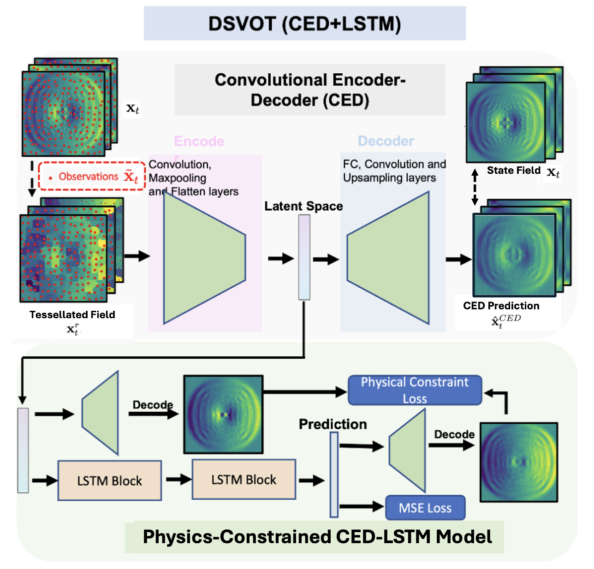

# Dynamical System Prediction from Sparse Observations Using Deep Neural Networks with Voronoi Tessellation and Physics Constraints (DSOVT)

## Overview
The DSOVT framework introduces an innovative approach to the spatio-temporal prediction of dynamical systems with sparse observations. Utilizing Voronoi tessellation, the framework integrates advanced deep learning models such as Convolutional Encoder-Decoder combined with Long Short-Term Memory (CED-LSTM) and Convolutional Long Short-Term Memory (ConvLSTM) to address nonlinear dynamic prediction challenges. By embedding physics constraints within these models, DSOVT achieves high accuracy and robust rolling forecasts, surpassing traditional Kriging-based methods in both computational efficiency and predictive performance.


## Numerical Experiments — NOAA Sea Surface Temperature
### NOAA Sea Surface Temperature Data Processing

This script processes sea surface temperature (SST) data to generate training and testing datasets. It reads SST data from a `.mat` file, interpolates missing values, and uses sparse sampling based on sensor configurations.

#### Usage
Execute via command line:
```bash
python ./NOAA/NOAA_data_generation.py <output_dir>
```
Replace <output_dir> with the path to your desired output directory.

### NOAA Kriging for Sea Surface Temperature Data

This Jupyter notebook `./NOAA/NOAA_kriging.ipynb` provides a comprehensive framework for processing sea surface temperature (SST) data using Kriging methods. It includes modules for data generation, generates sparse sampling based on sensor numbers and variables, and utilizes advanced geostatistical methods for spatial and temporal prediction.

### DSOVT (CED-LSTM)
The Jupyter notebook `./NOAA/NOAA_CEDLSTM.ipynb` outlines a framework for predicting sea surface temperature (SST) using the CED-LSTM model. It includes steps for training, predicting, and evaluating the model.


### DSOVT (ConvLSTM)
Similarly, the Jupyter notebook `./NOAA/NOAA_ConvLSTM.ipynb` details a framework for predicting SST using the ConvLSTM model. This approach includes training, multi-step prediction, and model evaluation.


## Numerical Experiments — Shallow Water Systems

### Shallow Water Systems Data Processing

The Jupyter notebook located at `./Shallow Water Systems/SW_data_generation.ipynb` processes shallow water data to create training and testing datasets. This setup prepares data for advanced analytical models.

### Shallow Water Kriging for Sea Surface Temperature Data

The notebook `./Shallow Water Systems/SW-Kriging.ipynb` offers a detailed framework for predicting shallow water fields using Kriging methods. It handles data generation, applies sparse sampling techniques based on sensor configurations, and employs advanced geostatistical methods for enhanced spatial and temporal predictions.

### DSOVT (CED-LSTM)

The notebook `./Shallow Water Systems/SW-CED-LSTM.ipynb` presents a comprehensive approach for predicting shallow water fields using the CED-LSTM model. The process includes training, predicting, evaluating the model, and incorporates Physics-Constrained Models to ensure the physical plausibility of the forecasts. It also outlines the rolling forecasting method for the predicting part.

### DSOVT (ConvLSTM)

Similarly, `./Shallow Water Systems/SW-ConvLSTM.ipynb` details a method for predicting SST using the ConvLSTM model. This model supports training, multi-step prediction, and evaluation. It also integrates Physics-Constrained Models to guide the learning process and includes strategies for rolling forecasting to enhance forecast reliability over time.

## Pre-Trained Model Parameters

We have made available the pre-trained model parameters for both the NOAA Sea Surface Temperature and Shallow Water Systems experiments. These parameters can be used to reproduce our results or as a starting point for further exploration and development of the models.

You can download the pre-trained models from the following link:
[Download Pre-Trained Models](https://drive.google.com/drive/folders/1IpRAkSKOb4QM0nHAglV9v1Wtz3KTkj9b?usp=sharing)

These parameters include trained weights and configuration settings for both the CED-LSTM and ConvLSTM models. Utilizing these pre-trained models can significantly reduce the initialization time and computational resources required for model training and provide a robust baseline for enhancing predictive performance in dynamical system applications.


5. 
## Dependencies
The script requires the following dependencies:
- Python 3.7
- NumPy
- Pandas
- SciPy
- h5py
- tqdm
- pykrige
- skimage
- matplotlib
Ensure all dependencies are installed using pip:


